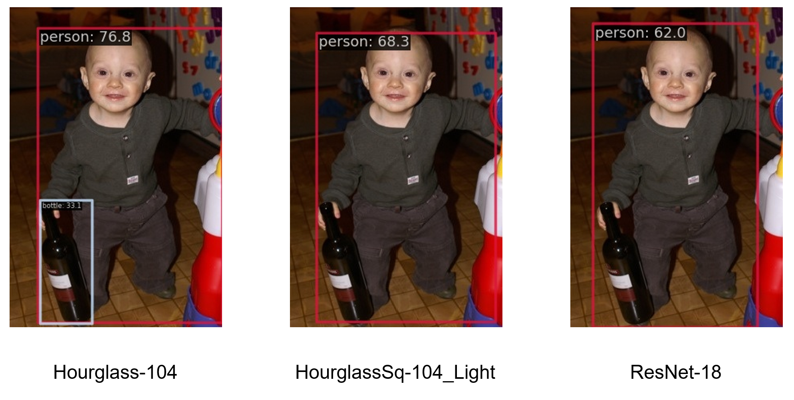

# CenterNet-lite



## Introduction

이 프로젝트는 CenterNet를 경량화 하기 위해 만들어졌습니다.
1. Backbone을 통째로 교체하는 방법
2. Hourglass의 resisual block을 fire module로 교체하는 방법
3. Head의 conv 연산을 depth-wise separable conv로 교체하는 방법

위 세 가지 방법을 시도하였습니다.

모든 작업은 MMDetection framework를 이용하여 진행되었습니다. 자세한 정보는 [공식 문서](https://mmdetection.readthedocs.io/en/latest/)를 참고해주세요.

## 방법

1. backbone 교체  
모델 별 [config 파일](./configs/centernet-lite/)을 만들고 [model settings 부분](./configs/centernet-lite/centernet_hgsq104_light.py?plain=1#L12)을 변경하였습니다.

2. fire module 구현  
residual block을 fire module로 교체한 새로운 [hourglass network 파일](./mmdet/models/backbones/hourglass_sq.py)을 만들었습니다.

3. light head 구현  
depth-wise separable conv를 사용하는 새로운 [light head 파일](./mmdet/models/dense_heads/centernet_head_light.py)을 만들었습니다.

## Installation

Docker를 이용하여 환경을 설정합니다.

Step 1.

    git clone https://github.com/samkwon1122/CenterNet-light.git

Step 2.

    cd CenterNet-light
    docker build -t mmdetection docker/
    docker run --gpus all --shm-size=8g -it -v {DATA_DIR}:/mmdetection/data -v {WORK_DIR}:/mmdetection/work_dirs mmdetection

데이터는 다음과 같이 구성해줍니다. 본 프로젝트에서는 Pascal VOC 데이터를 사용하였습니다.

    data
    ├── VOCdevkit
    │   ├── VOC2007
    │   │   ├── Annotations
    │   │   ├── ImageSets
    │   │   ├── JPEGImages
    │   ├── VOC2012
    │   │   ├── Annotations
    │   │   ├── ImageSets
    │   │   ├── JPEGImages

## Training

/mmdetection/configs/centernet-lite 폴더에 모델 별 config 파일이 있습니다.

다음과 같은 방법으로 학습을 진행합니다.

    python tools/train.py ${CONFIG_FILE}

예시

    python tools.train.py configs/centernet-lite/centernet_hgsq104_light.py

학습이 진행되면 /mmdetection/work_dirs/ 경로에 log 및 checkpoint 파일이 저장됩니다.

## Test

학습이 완료된 모델의 성능을 테스트 합니다.
    
    python tools/test.py ${CONFIG_FILE} ${CHECKPOINT_FILE}

모델의 FPS를 측정합니다.

    python -m torch.distributed.launch --nproc_per_node=1 --master_port=${PORT} tools/analysis_tools/benchmark.py ${CONFIG} --checkpoint ${CHECKPOINT} --launcher pytorch

모델의 복잡도를 측정합니다.

    python tools/analysis_tools/get_flops.py ${CONFIG_FILE}

예시
```bash
#mAP
python tools/test.py configs/centernet-lite/centernet_hgsq104_light.py work_dirs/centernet_hgsq104_light/epoch_10.pth

#FPS
python -m torch.distributed.launch --nproc_per_node=1 --master_port=29500 tools/analysis_tools/benchmark.py configs/centernet-lite/centernet_hgsq104_light.py --checkpoint work_dirs/centernet_hgsq104_light/epoch_10.pth --launcher pytorch

#Complexity
python tools/analysis_tools/get_flops.py configs/centernet-lite/centernet_hgsq104_light.py 
```

## Demo

특정 이미지에 대한 추론 결과를 확인할 수 있습니다.

    python demo/image_demo.py ${IMAGE_FILE} ${CONFIG_FILE} --weights ${WEIGHTS}

예시

    python demo/image_demo.py demo/demo.jpg configs/centernet-lite/centernet_hgsq104_light.py --weights work_dirs/centernet_hgsq104_light/epoch_10.pth

## 학습 조건

- GPU: NVIDIA GeForce RTX 3060
- Epochs: 50
- Learing Rate: 2.5e-4, 40epoch 이후로는 2.5e-5
- Optimizer: Adam
- Batch Size: 16 (Hourglass-104의 경우 메모리 부족으로 6)
- 모든 모델 동일하게 학습 진행

## Results

| Model | mAP | Runtime Mem (MB) | Params (M) | GFlops | FPS (img/s) | File Size (MB) | Config | Checkpoint |
|:-:|:-:|:-:|:-:|:-:|:-:|:-:|:-:|:-:|
| ResNet-18 | 0.352 | 293 | 14.433 | 8.85 | 152.3 | 63.14 | [config](./configs/centernet-lite/centernet_r18-dcnv2.py) | [checkpoint](https://drive.google.com/file/d/1ic2yW8z_jPUKHApSrMxLQfoNqgn_GBmo/view?usp=drive_link) |
| ResNet-50 | 0.236 | 630 | 30.677 | 17.481 | 70.1 | 125.35 | [config](./configs/centernet-lite/centernet_r50-dcnv2.py) | [checkpoint](https://drive.google.com/file/d/1mAfWWxmHcchYy_92SkdZy07UjNn3hJXk/view?usp=drive_link) |
| Hourglass-104 | 0.631 | 848 | 189 | 189 | 17.0 | 742.10 | [config](./configs/centernet-lite/centernet_hg104.py) | [checkpoint](https://drive.google.com/file/d/1YdAso1pzpdf80aCk_PZFey8o_EVmMOPW/view?usp=drive_link) |
| Hourglass_Sq-104 | 0.571 | 96 | 11.546 | 20.243 | 91.2 | 52.64 | [config](./configs/centernet-lite/centernet_hgsq104.py) | [checkpoint](https://drive.google.com/file/d/1LehrUJn55SX056PuKm4-qYjEekvx-N-w/view?usp=drive_link) |
| Hourglass_Sq-104_Light | 0.587 | 90 | 9.981 | 15.654 | 96.3 | 46.68 | [config](./configs/centernet-lite/centernet_hgsq104_light.py) | [checkpoint](https://drive.google.com/file/d/1shM0tsLsfkmzAxL-As9BvKklx6hXPTpC/view?usp=drive_link) |
| MobileNetV2 | 0.364 | 334 | 7.436 | 3.257 | 131.4 | 36.63 | [config](./configs/centernet-lite/centernet_mbv2-dcnv2.py) | [checkpoint](https://drive.google.com/file/d/1HYhEKaYbLE3b9Gcpa-5-iv0c5gPFCNdG/view?usp=drive_link) |
| EfficientNet-B0 | 0.458 | 338 | 9.22 | 3.582 | 86.9 | 43.50 | [config](./configs/centernet-lite/centernet_efb0-dcnv2.py) | [checkpoint](https://drive.google.com/file/d/1kfizlz-K3_aLLnn9ZTj-2DxDapC-wEid/view?usp=drive_link) |


Model: 해당 모델에 사용된 backbone 이름  
Sq: SqueezeNet에서 소개된 fire module을 residual block 대신 사용  
Light: depth-wise separable conv를 적용한 light head 사용

## Idea

- [Objects as Points](https://arxiv.org/pdf/1904.07850.pdf)
- [CornerNet: Detecting Objects as Paired Keypoints](https://arxiv.org/pdf/1808.01244.pdf)
- [CornerNet-Lite: Efficient Keypoint Based Object Detection](https://arxiv.org/pdf/1904.08900.pdf)
- [MobileNetV2: Inverted Residuals and Linear Bottlenecks](https://arxiv.org/pdf/1801.04381.pdf)
- [SqueezeNet: AlexNet-level accuracy with 50x fewer parameters and <0.5MB model size](https://arxiv.org/pdf/1602.07360.pdf)

해당 논문들의 아이디어를 메인으로 진행되었습니다.
